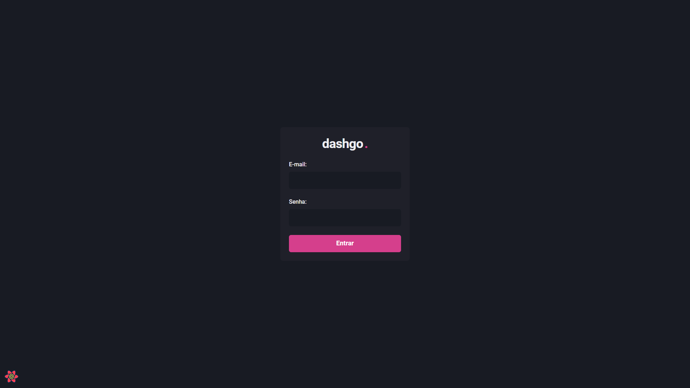
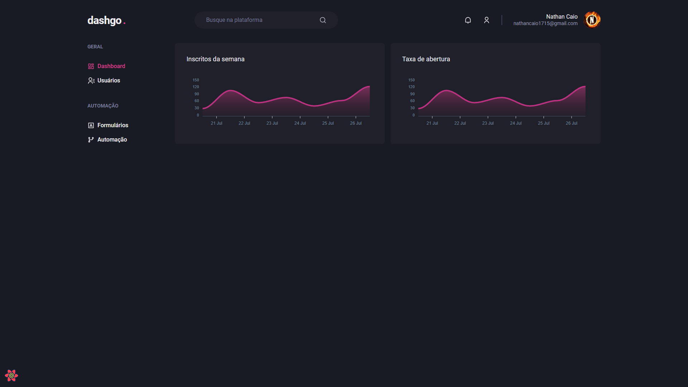
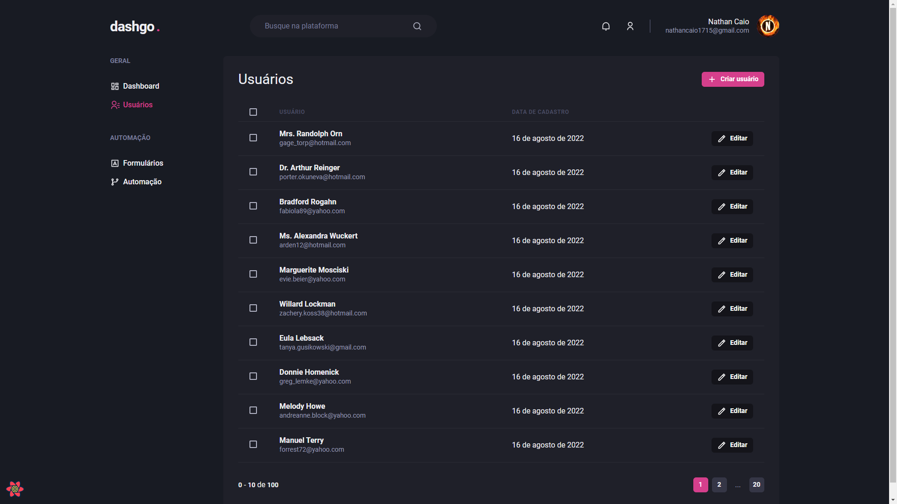
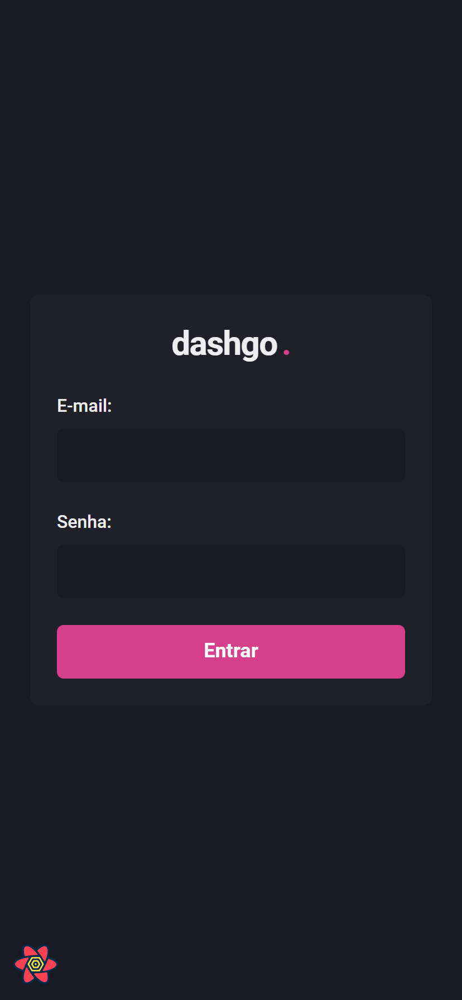
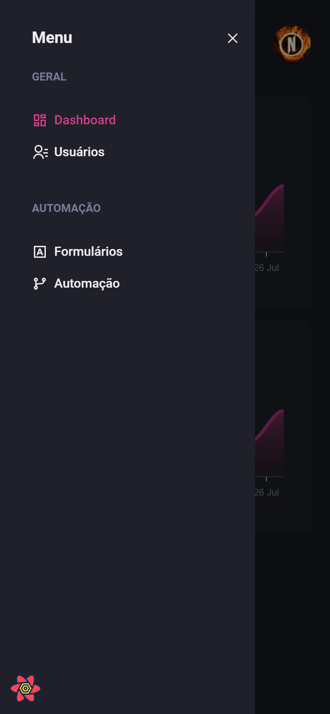
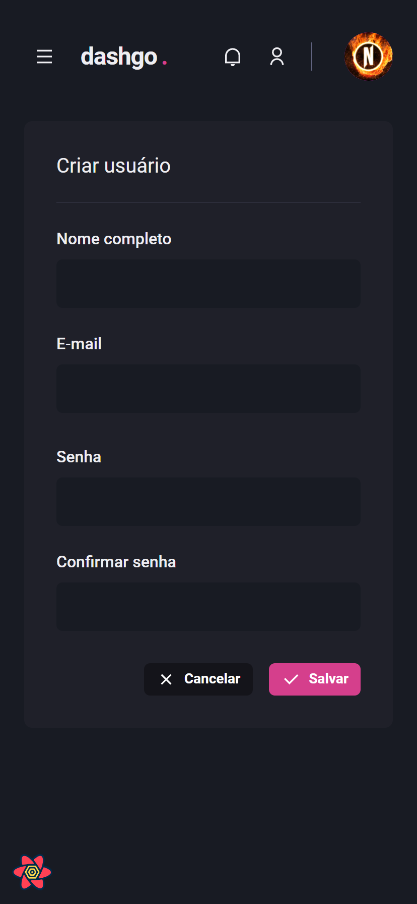
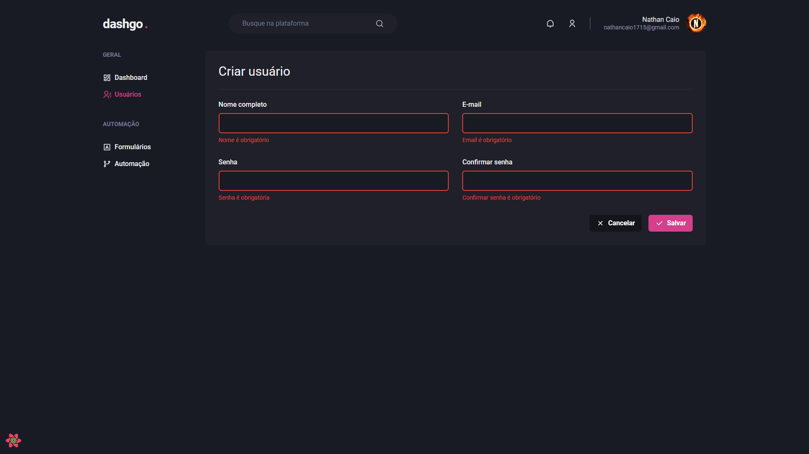
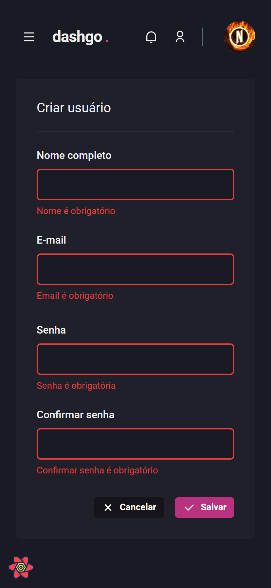

# dashgo
This project was made for study purposes, possible due to [Rocketseat](https://www.rocketseat.com.br/)'s Ignite course.

## Technologies used
- Next.js
- TypeScript
- Chakra UI
- React Hook Form
- Yup
- Axios
- React Query
- Jest & Testing Library
- Faker
- MirageJS

## Screenshots

### Desktop

Login page

Dashboard page

User list page

Create User page

### Mobile

Login page

Dashboard page

Sidebar

User list page

Create User page

### React Hook Form and Yup validation

